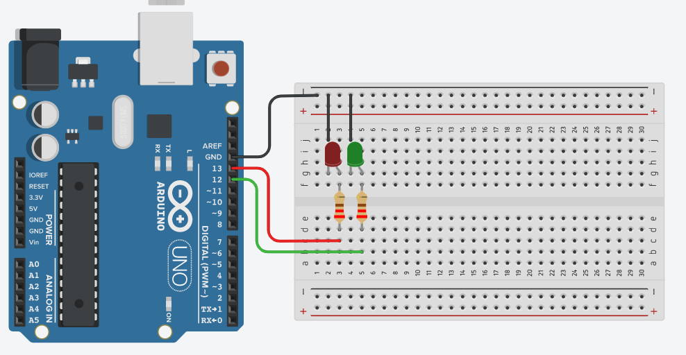

# Projeto Arduíno para piscar o led incorporado v1.

## Contextualização

-Neste experimento você irá fazer com que o LED incorporado e dois LEDs acendam e apaguem em
sequência utilizando o pino digital 13 (pino digital incorporado LED_BUILTIN = 13) e o pino digital 12. 

## Esquema do projeto

